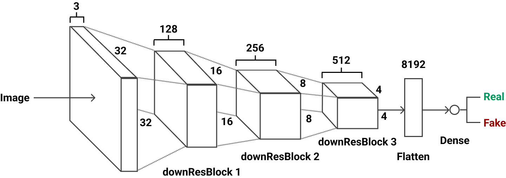
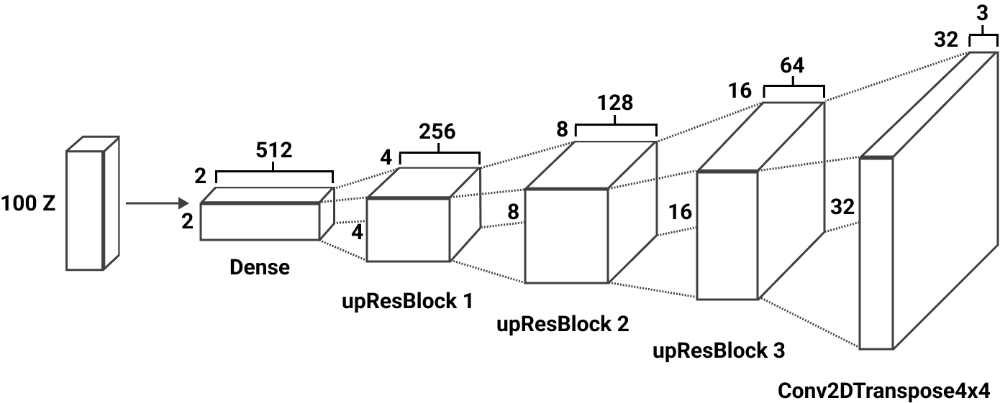
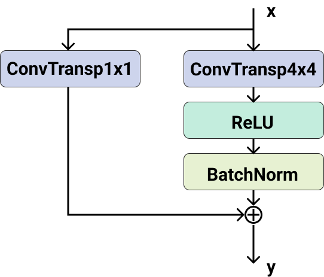
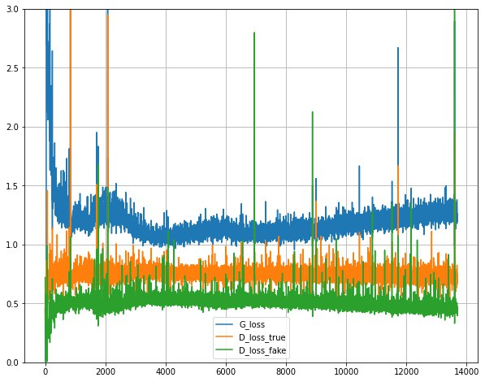
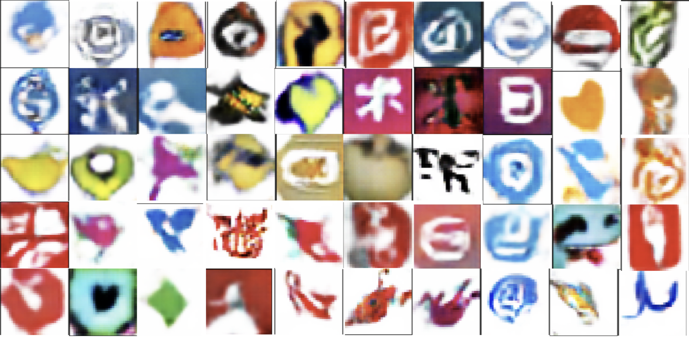

# IconiGAN

  
## Authors

The following people, in alphabetical order, have authored of IconiGAN repository:

- **Marco Manco**
- **Alexander Carlo Gustavo Spira**
- **Lorenzo Valente**

## Abstract

A logo is one of the most important parts of a brand. It represents the original and unique symbol that reflects the value of the brand and creates a first impression on a cus- tomer. Small or large, whatever the proportion they may be, all activities - industrial,craft, commercial - shops, ser- vice firms, professional firms - all need a compelling, strong and recognizable logo that helps the business have more success, which is why creating an effective brand identity is essential. What we created is a Generative Adversarial Network [9] that can be used to generate random icons that can be used as inspiration or as a starting point for the creation of an original logo. In particular we have taken advantage of using convolutional layers to create a Deep Convolutional GAN (DCGAN) [5] that was able to analyze and extract high-level features from our dataset. Starting from a large pool of logos, the network develops various and heterogeneous examples which cover a lot of shapes and colors, from geometrical structures to figures that re- call little objects, animals and plants.

## Model and Loss

Inspired by ResBlock, we propose upResBlock and downResBlock by combining deconvolution, strided convolution, and ResBlock.
The motivation behind up and down residual blocks is to utilize the upsides of ResBlock, i.e., creating pictures rapidly from noise and more efficient backward propagation of gradients.
The model was trained on Colab with GPU set as a hardware accelerator, with the [5kLDD](https://data.vision.ee.ethz.ch/sagea/lld/) dataset. The time required to train the final model was 1 hour and 20 minutes.

### upResBlock

As illustrated in Figure, the upResBlock allow making full use of the information of the former layers. In fact, our upResBlock could make all information pass through and make backward propagation of gradients more efficiently with the help of shortcut:

> y = B(R(C(x))) + C(x) (1)

where y indicates the output of the layer considered; C means the convolutional layers; R means the the activation function ReLU and B indicates the batch normalization.

### downResBlock

To make it possible for a discriminator to preserve the full features, especially the useful features, which increases the difficulty of the convergence of loss, we introduce our downResBlock. The structure of this block can be formu- lated as:

> y = L(C(x)) + C(x) (2)

where L indicates the activation function LeakyReLU and C is same as Equation 1. Through such a construc- tion, our downResBlock could save the feature from previ- ous layers which helps the convergence of loss.

## Results

The final model, as shown in Figure, has an error that follows the trend explained earlier.

In addition, after 350 epochs, you can see the final images generated in Figure.

The images we selected as example may appear blurry because of the low resolution of 32x32 pixels which is the resolution of the images of the dataset used for the training. Other than that some of them, as previously said, can recall, with some fantasy, to some real object or living beings stylized and simplified. Some can be seen as a negative of the background since some logos originally also have a background color. Sometimes there are too many details that, given the low resolution, appear to be like a splash of colors or vice versa appear to be nothing because the figure is thin or composed with a similar color of the background. Most of the time there are circular figures with some kind of shape inside that could be compared to an alphanumeric value.
